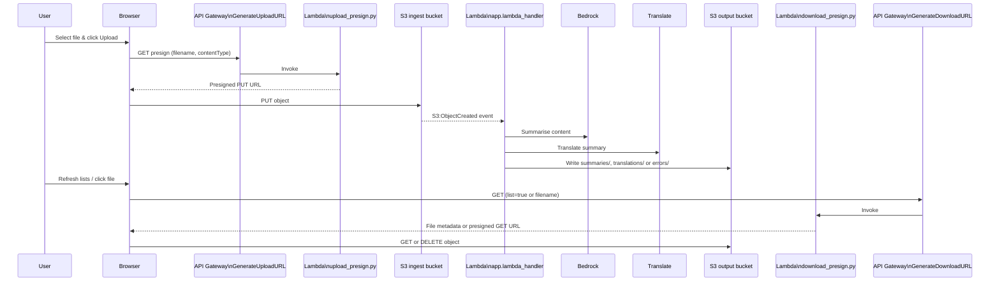

# Summary Translator

Summary Translator is a sample GenAI workflow that ingests documents from a browser, summarises them with Amazon Bedrock, translates the result with Amazon Translate, and stores the outputs back in Amazon S3. It pairs two lightweight presign Lambdas with a static HTML dashboard you can host anywhere (e.g., Lightsail) to provide an end-to-end experience for uploading, reviewing, downloading, and tidying generated artefacts.

## Architecture Overview

```mermaid
flowchart LR
    subgraph Browser
        UI[index.html\n(Static site)]
    end

    subgraph AWS
        APIGW_UPLOAD[API Gateway HTTP API\nGenerateUploadURL]
        LAMBDA_UPLOAD[Lambda\nupload_presign.py]
        INGEST[(S3 ingest bucket\n`genai-in-use1-x7p5f0`)]
        PIPELINE[Lambda\napp.lambda_handler]
        BEDROCK[(Amazon Bedrock)]
        TRANSLATE[(Amazon Translate)]
        OUTPUT[(S3 output bucket\n`genai-out-use1-x7p5f0`)]
        APIGW_DOWNLOAD[API Gateway HTTP API\nGenerateDownloadURL]
        LAMBDA_DOWNLOAD[Lambda\ndownload_presign.py]
    end

    UI -- GET presign --> APIGW_UPLOAD --> LAMBDA_UPLOAD --> INGEST
    UI -- PUT object --> INGEST
    INGEST -- S3:ObjectCreated --> PIPELINE
    PIPELINE --> BEDROCK
    PIPELINE --> TRANSLATE
    PIPELINE --> OUTPUT
    UI -- List / presign --> APIGW_DOWNLOAD --> LAMBDA_DOWNLOAD --> OUTPUT
    UI -- Open / download --> OUTPUT
```

### Document Processing Flow



## Features

- **Static UX** – A single `index.html` file with a gradient background, branded badge, upload controls, result panes, manual download buttons, and per-file delete icons.
- **Presigned upload** – `upload_presign.py` forces uploads into the `incoming/` prefix of the ingest bucket and supports optional content-type hints.
- **List / download / delete** – `download_presign.py` lists objects in `summaries/`, `translations/`, and `errors/`, presigns GET URLs, and supports scoped deletions with S3 IAM permissions.
- **Processing pipeline** – `app.py` summarises via Amazon Bedrock (default: `anthropic.claude-3-haiku-20240307-v1:0`) and translates via Amazon Translate.
- **Infrastructure as Code** – `template.yaml` (SAM) provisions S3 buckets, Lambdas, roles, and wiring with inline IAM policies.
- **CI-ready deployment** – `.github/workflows/deploy.yml` uses `appleboy/scp-action` and `appleboy/ssh-action` to sync the static site to an Amazon Lightsail instance over SSH.

## Repository Layout

| Path | Description |
| --- | --- |
| `index.html` | Static front-end (upload/download dashboard). |
| `src/upload_presign.py` | Lambda that grants presigned PUT URLs. |
| `src/download_presign.py` | Lambda for listing, presigning, and deleting output artefacts. |
| `src/app.py` | Worker Lambda triggered by S3 ingest events; handles Bedrock + Translate flow. |
| `template.yaml` | AWS SAM template for buckets, roles, Lambdas, and triggers. |
| `.github/workflows/deploy.yml` | GitHub Actions pipeline for Lightsail static hosting deployment. |

## Deployment

### 1. Deploy the Backend with SAM

```bash
sam build
sam deploy --guided \
  --region us-east-1 \
  --parameter-overrides \
    IngestBucketName=genai-in-use1-x7p5f0 \
    OutputBucketName=genai-out-use1-x7p5f0 \
    TargetLanguage=fr \
    ModelId="anthropic.claude-3-haiku-20240307-v1:0"
```

Update the parameters to match your environment (model, buckets, language).

### 2. Augment IAM for the Download Lambda

Add list/get/delete so the presign Lambda can manage output objects:

```bash
aws iam put-role-policy \
  --role-name GenerateDownloadURL-role-XXXX \
  --policy-name AllowDownloadAccess \
  --policy-document '{
    "Version": "2012-10-17",
    "Statement": [
      {"Effect":"Allow","Action":"s3:ListBucket","Resource":"arn:aws:s3:::genai-out-use1-x7p5f0"},
      {"Effect":"Allow","Action":["s3:GetObject","s3:DeleteObject"],"Resource":"arn:aws:s3:::genai-out-use1-x7p5f0/*"}
    ]
  }'
```

### 3. Front-end Hosting (Lightsail Workflow)

1. Provision a Lightsail instance running Apache or Nginx.
2. Ensure you can SSH with the Lightsail default key.
3. Add the following repository secrets:
   - `LIGHTSAIL_HOST`, `LIGHTSAIL_USER`, `LIGHTSAIL_SSH_KEY`, optional `LIGHTSAIL_SSH_PORT`.
4. Push changes to the tracked branch (`main` or feature branch). The GitHub Actions workflow uploads files to `/var/www/html/` and reloads Apache.

> Prefer a fully serverless host? Copy `index.html` to an S3 static website bucket behind CloudFront.

### Basic CLI Tests

```bash
# Upload a test file straight to the ingest bucket
aws s3 cp sample.txt s3://genai-in-use1-x7p5f0/incoming/sample.txt --region us-east-1

# Inspect generated outputs
aws s3 ls s3://genai-out-use1-x7p5f0/summaries/
aws s3 ls s3://genai-out-use1-x7p5f0/translations/
aws s3 ls s3://genai-out-use1-x7p5f0/errors/
```

## Security & Operations Notes

- Presign Lambdas surface only the operations needed (PUT for ingest, GET/DELETE for outputs) and never expose AWS credentials to the browser.
- CORS headers are uniform for GET/OPTIONS/DELETE, enabling the static UI without awkward preflight failures.
- Inline IAM keeps policies minimal; review and adapt for enterprise controls (e.g., SCPs, AWS Config).
- If you expose the UI publicly, front it with CloudFront or ALB and add TLS + authentication (SAML/Cognito/etc.).
- Lightsail IPs can be masked via Route 53 A-records or CloudFront distributions; the README architecture diagrams cover both single-site and CDN options.

## Extending the Solution

- Swap the Bedrock model (`ModelId`) or target language to support additional locales.
- Add moderation/pre-processing (Comprehend, Textract) before invoking Bedrock.
- Replace the static HTML with a React/Vue app, reusing the same presign APIs.
- Schedule clean-up (Lifecycle rules or Lambda) to archive or purge old summaries.

## License

This project is provided for educational purposes. Review and adapt to meet your organisation’s security, compliance and operational requirements before deploying to production.
